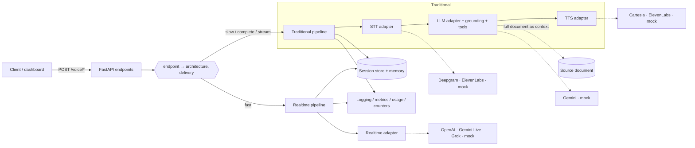

# Voice AI Agent

A dual-pipeline voice assistant served as a single **FastAPI** service — document-grounded,
tool-capable, and streaming end to end.


Two pipelines, one service, **no backend router** — the client picks a pipeline purely by
*which endpoint URL it calls*:

- **Traditional (slow) path** — streaming STT → LLM → streaming TTS. Handles complex,
  document-grounded, tool-capable turns. The full source document is supplied to the model as
  context — **no vector store / RAG**.
- **Realtime (fast) path** — voice-to-voice over WebSocket for low-latency conversation.

Providers and pipelines sit behind small adapter interfaces, so swapping a vendor is a
**configuration change, not a code change**.

📖 **Docs:** [API reference](docs/api.md) · [Configuration](docs/configuration.md) ·
[Architecture & design](docs/architecture.md)

---

## Features

| | |
|---|---|
| 🎙️ **Dual pipeline, no router** | The endpoint URL selects traditional vs. realtime — no routing field, no server-side classifier |
| 🔌 **Config-driven providers** | STT / LLM / TTS / realtime adapters chosen by env var; each is Protocol-typed and mock-testable |
| 📚 **Full-document grounding** | The whole source document is the model's context (prompt-cached when the tier allows) — no RAG plumbing |
| 🛠️ **Tool / function calling** | Typed tool registry with a `book_appointment` reference tool |
| 🧠 **Sessions & memory** | Tenant-scoped session store, rolling conversation memory, explicit per-turn state machine |
| ⏱️ **Turn-taking & barge-in** | End-of-turn detection; a new utterance interrupts an in-flight spoken reply |
| 🪂 **Graceful degradation** | A failed realtime turn falls back to the traditional pipeline before first audio |
| 🔒 **Security** | Bearer-JWT auth (HS256 + tenant claim), CORS lockdown, per-key/IP rate limiting, PII-safe logging |
| 📈 **Observability** | Structured JSON logs with correlation/session/tenant ids; latency, usage, and error/fallback endpoints |
| 🖥️ **Reference dashboard** | Dependency-free browser client served at `/ui` (mic capture, live captions, streamed audio) |

## Endpoints

| Method | Path | Pipeline | Delivery |
|--------|------|----------|----------|
| `POST` | `/api/v1/voice/fast` | realtime | SSE (audio) |
| `POST` | `/api/v1/voice/slow` | traditional | SSE |
| `POST` | `/api/v1/voice/complete` | traditional | one JSON payload |
| `POST` | `/api/v1/voice/stream` | traditional | SSE |

Ops & discovery: `GET /healthz`, `GET /docs` (Swagger), `GET /api/v1/{config,metrics,usage,counters}`.
Every request body is the same shape; the SSE grammar is `transcript.partial → transcript.final
→ answer.delta* → audio.chunk* → done`. See the [API reference](docs/api.md).

## Providers

Selected per role via `*_PROVIDER` env vars; set all four to `mock` to run offline with no keys.

| Role | Default | Alternates | `mock` |
|------|---------|-----------|:------:|
| STT | Deepgram Nova-3 | ElevenLabs Scribe | ✅ |
| LLM | Gemini (Flash) | — | ✅ |
| TTS | Cartesia Sonic | ElevenLabs | ✅ |
| Realtime | OpenAI Realtime | Gemini Live, xAI Grok | ✅ |

## Architecture



## Quickstart

### Local

```bash
python3 -m venv .venv
source .venv/bin/activate
pip install -r requirements-dev.txt

# run offline (no API keys) with the mock providers
STT_PROVIDER=mock LLM_PROVIDER=mock TTS_PROVIDER=mock REALTIME_PROVIDER=mock \
  uvicorn app.main:app --reload --port 8080

# http://127.0.0.1:8080/healthz  -> {"ok": true}
# http://127.0.0.1:8080/docs     -> Swagger UI
# http://127.0.0.1:8080/ui/      -> reference dashboard

pytest                    # 445 offline tests (mock providers, no network)
python -m scripts.smoke   # endpoint smoke check
python -m evaluation      # accuracy + latency + grounding harness
```

Copy [`.env.example`](.env.example) to `.env` for real providers; every setting is documented
in [docs/configuration.md](docs/configuration.md). **Never commit real secrets** — `.env` is
git-ignored and excluded from the Docker build context.

### Docker

The same slim, non-root `python:3.12-slim` image runs identically locally, in CI, and on
Cloud Run (which injects `$PORT`):

```bash
docker build -t voice-ai-agent .

# offline demo — mock providers, dashboard at /ui
docker run --rm -p 8080:8080 \
  -e STT_PROVIDER=mock -e LLM_PROVIDER=mock -e TTS_PROVIDER=mock -e REALTIME_PROVIDER=mock \
  voice-ai-agent

# real providers — pass secrets at runtime (never baked into the image), mount the doc
docker run --rm -p 8080:8080 --env-file .env \
  -v "$PWD/source.pdf":/data/source.pdf:ro -e SOURCE_DOC_PATH=/data/source.pdf \
  voice-ai-agent
```

The image is rebuilt and smoke-tested on every PR (`.github/workflows/`), so a broken build
blocks merge.

## Project layout

```
app/
  main.py         # app factory: settings, document, sessions, security, observability, pipelines
  config.py       # typed, fail-fast settings
  dispatch.py     # endpoint -> (architecture, delivery); no router
  api/voice.py    # the four voice endpoints
  auth.py         # bearer-JWT authentication (tenant claim)
  ratelimit.py    # token-bucket rate limiting
  streaming/      # shared request schema + SSE event contract
  pipelines/      # traditional (STT->LLM->TTS) + realtime, fallback, turn-taking
  providers/      # STT/LLM/TTS/realtime adapters + config-driven factory
  context/        # full-document grounding (no RAG)
  tools/          # tool / function-calling registry
  session/        # session store, rolling memory, turn state machine
  observability/  # structured logging, latency, usage, counters, PII scrubbing
evaluation/       # offline accuracy + latency + grounding harness
scripts/          # operational scripts (endpoint smoke)
frontend/         # browser dashboard, served at /ui
docs/             # api, configuration, architecture references
tests/            # offline test suite (mock providers), run in CI
```

## Status

The application is functionally complete and verified live end-to-end (text → grounded Gemini
answer → streamed Cartesia speech). Remaining work is cloud/ops infrastructure — GCP provisioning,
CI/CD deploy, secret manager, alerting, and telephony (Twilio/Vapi) — tracked separately.

## Contributing

- **One branch per change**, named `<owner>/<ticket>` (e.g. `shiva/va-01`); nothing is committed
  directly to `main`.
- **Every branch opens a pull request to `main`**; merges require review (see
  [`.github/CODEOWNERS`](.github/CODEOWNERS)) and green checks.
- **A Dockerfile is required** — the service must build and run identically locally, in CI, and
  in the cloud.
- Tests are **offline and mock-based** — no live provider calls in CI. Run `ruff check` and
  `pytest` before opening a PR.
