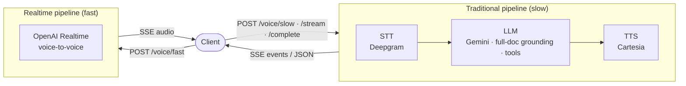

# Architecture & design

A dual-pipeline voice assistant served as a **single FastAPI service**. Two design decisions
shape everything else.

## 1. No backend router — the endpoint selects the pipeline

There is no server-side classifier that decides how to handle a turn. The client picks a
pipeline purely by *which endpoint URL it calls*, and the request body carries no
`architecture`/`mode` field (it is rejected). This keeps intent explicit, removes a layer of
routing latency and mis-classification, and makes each endpoint's behavior a fixed contract.



## 2. No RAG — full-document grounding

The **entire** source document is supplied to the model as context (with prompt caching)
rather than retrieved from a vector store. The target corpus fits the model's context window,
so this avoids retrieval infrastructure, chunk-boundary information loss, and an extra failure
mode — at the cost of a large but *cached* context. The model is instructed to answer strictly
from the document, cite the exact article/clause, and decline honestly when the answer is not
present. Grounding is wired in three steps: **load** (VA-35) → **cache** (VA-36) → **ground**
(VA-37), and citations are pulled from the answer for the turn trace.

## Provider adapter pattern

Every external service sits behind a small `Protocol` interface (`SttProvider`, `LlmProvider`,
`TtsProvider`, `RealtimeProvider`). Concrete adapters:

- implement the protocol and a `from_settings(settings)` constructor;
- take an **injectable transport/client** so tests drive them with no live calls;
- register in `app/providers/factory.py` under a config name via a lazy-import builder.

Swapping a provider is therefore a **configuration change, not a code change**, and `mock` is
always registered so the whole service runs offline. See
[configuration.md](configuration.md) for the selection keys.

## Module layout

| Module | Responsibility |
| --- | --- |
| `app/main.py` | App factory; wires settings, document, session store, observability, pipelines; ops endpoints |
| `app/config.py` | Typed, fail-fast settings (env / `.env`) |
| `app/dispatch.py` | `Endpoint → (architecture, delivery)` map + `run_for_endpoint`; **no router** |
| `app/api/voice.py` | The four voice endpoints |
| `app/streaming/` | Shared request schema, SSE event grammar, published contract |
| `app/pipelines/traditional/` | STT → LLM → TTS slow path |
| `app/pipelines/realtime/` | Voice-to-voice fast path |
| `app/providers/` | Adapter protocols, mocks, and the config-driven factory |
| `app/context/` | Full-document load + grounding (no RAG) |
| `app/tools/` | Tool / function-calling registry (+ `book_appointment`) |
| `app/session/` | Session store, rolling conversation memory, per-turn state machine |
| `app/observability/` | Structured logging, latency, usage, counters |
| `evaluation/` | Offline accuracy + latency + grounding harness |
| `scripts/` | Operational scripts (endpoint smoke) |

## Request lifecycle (traditional path)

```mermaid
sequenceDiagram
  participant C as Client
  participant E as /voice/slow
  participant P as TraditionalPipeline
  participant S as Session + Memory
  C->>E: POST {input}
  E->>P: run_for_endpoint(SLOW)
  P->>S: resolve session, build rolling memory
  P-->>C: transcript.final   (STT)
  P-->>C: answer.delta*       (LLM, grounded over full doc + tools)
  P-->>C: audio.chunk*        (TTS)
  P->>S: persist turns; record latency / usage / counters
  P-->>C: done {session_id, latency_ms}
```

The realtime path is simpler: the fast endpoint feeds mic audio to the realtime adapter, which
streams model audio back as `audio.chunk` events, then `done` — no separate transcript/answer.
A per-turn **state machine** (`idle → listening → thinking → speaking`, with `barge_in`) tracks
turn state; the **session store** is tenant-scoped and keyed by `session_id`, and a **rolling
memory** rebuilds the prompt context each turn within a token budget.

## Observability

Every turn emits structured JSON logs carrying a `correlation_id` (also the `X-Request-ID`
header), `session_id`, and `tenant_id`, and records:

- **latency** per stage (`/api/v1/metrics`, p50/p95/max),
- **usage** — tokens + audio-seconds per path/tenant (`/api/v1/usage`),
- **counters** — turns/errors/fallbacks + rates (`/api/v1/counters`).

## Deployment shape

The service is containerized (multi-stage slim `python:3.12`, non-root) and targets **Cloud
Run**, which injects `$PORT` and needs streaming-friendly settings (raised timeout, session
affinity, CPU always-allocated) for long-lived SSE/WebSocket connections. Secrets come from
Secret Manager; CI authenticates keylessly via Workload Identity Federation. *The GCP/CI
infrastructure tickets are tracked separately and not yet built — the application is
cloud-ready by construction.*

## Testing & evaluation

Everything runs offline on the mock providers: **~95%** unit coverage
([tests/README.md](../tests/README.md)), an integration test of a full turn per path, an
[evaluation harness](../evaluation/README.md) (accuracy + latency + document grounding), and an
endpoint [smoke](../scripts/smoke.py) wired into CI.
